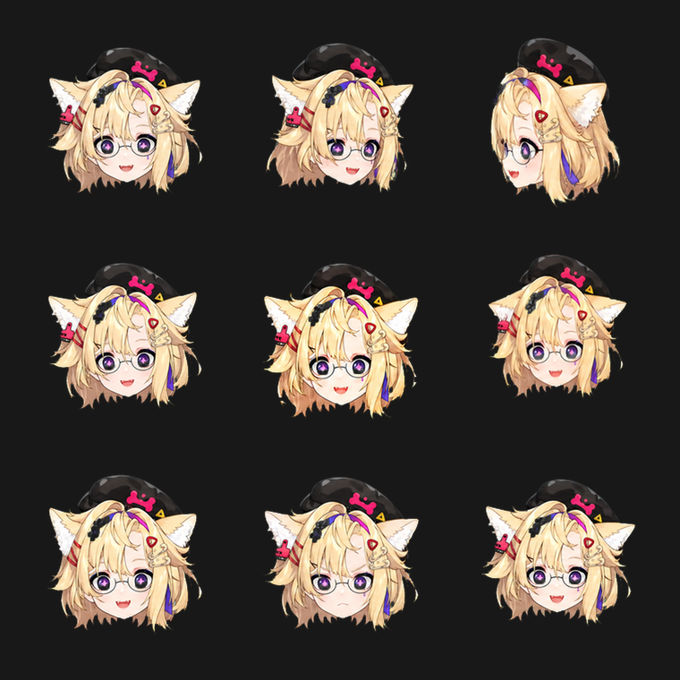
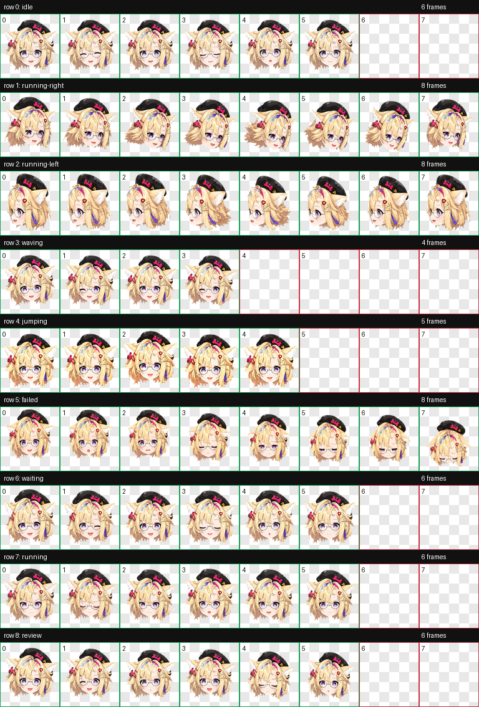

# Yukie Head Pet

这是一个 Codex 自定义宠物与 QQ 表情包导出项目。

## 内容

- `outputs/yukie-head/`：Codex 宠物成品
  - `pet.json`
  - `spritesheet.webp`
  - `contact-sheet.png`
  - `validation.json`
- `outputs/yukie-head-codex-pet.zip`：可分享的 Codex 宠物包
- `outputs/yukie-head-demo.html`：9 形态展示页面，适合录制 demo
- `outputs/yukie-head-stickers/`：从 9 形态动画导出的表情包
  - `qq-gif/`：推荐导入 QQ 的 240×240 动态 GIF
  - `qq-png/`：QQ 不接受 GIF 时使用的静态 PNG
  - `png/`、`gif/`、`webp/`：512×512 高清导出版
  - `preview-sheet.png`：9 宫格预览图
- `outputs/yukie-head-stickers.zip`：QQ 表情包打包文件
- `tools/export_sticker_pack.py`：从 `spritesheet.webp` 重新导出表情包的脚本

## 预览





## 重新导出表情包

```powershell
python tools\export_sticker_pack.py `
  --spritesheet outputs\yukie-head\spritesheet.webp `
  --validation outputs\yukie-head\validation.json `
  --pet-json outputs\yukie-head\pet.json `
  --output-dir outputs\yukie-head-stickers
```

导出结果会生成：

- `outputs/yukie-head-stickers/qq-gif`
- `outputs/yukie-head-stickers/qq-png`
- `outputs/yukie-head-stickers.zip`

## QQ 导入建议

优先导入 `outputs/yukie-head-stickers/qq-gif` 里的 9 个 GIF 文件。它们已经按中文状态和序号命名，尺寸统一为 240×240。

如果当前 QQ 客户端不接受动态 GIF，可以改导入 `qq-png` 目录里的静态 PNG。
